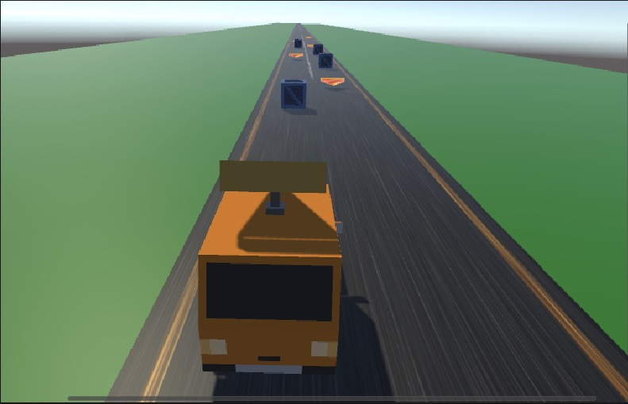
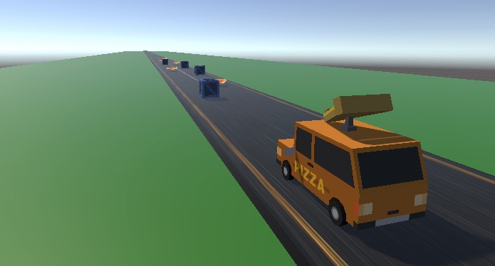

# 🍕 Pizza Picker - The Ultimate Pizza Delivery Adventure! 🚚

  
  
  
  ### Race against time to deliver pizzas and avoid obstacles! 🏃‍♂️💨

## 🎮 Game Preview

  
   
  <em>Navigate through the highway collecting pizzas!</em>
    
  
   
  <em>Avoid obstacles and manage your deliveries!</em>

## 🎮 Game Overview

Pizza Picker is an exciting arcade-style delivery game where you control a delivery van on a mission to collect and deliver pizzas while avoiding obstacles. Test your reflexes and strategic thinking as you navigate through challenging paths!

## ✨ Key Features

- 🚐 Smooth and responsive van controls
- 🍕 Dynamic pizza collection system
- 📦 Obstacle avoidance challenges
- 💯 Real-time score tracking
- 🎯 Intuitive gameplay mechanics

## 🎯 How to Play

1. 🎮 Use **LEFT** and **RIGHT** arrow keys to control the van
2. 🍕 Collect pizzas to earn points
3. 📦 Avoid crates to prevent losing points
4. 🎯 Try to achieve the highest score possible!

## 🛠️ Technical Details

- Built with Unity 2022.3.6f1
- Written in C#
- Features advanced collision detection
- Implements singleton pattern for score management
- Utilizes Unity's physics system

## 🚀 Getting Started

To run this game:
1. Clone the repository
2. Open with Unity 2022.3.6f1 or later
3. Load the main scene
4. Hit play and enjoy!

## 🎨 Game Elements

- **Van** 🚚: Your delivery vehicle
- **Pizzas** 🍕: Collect these for points
- **Crates** 📦: Obstacles to avoid
- **Score Display** 💯: Track your progress

## 🎱 Game Mechanics

- Move left and right to navigate
- Auto-forward movement
- Collision detection with pizzas and crates
- Score system with real-time updates
- Obstacle avoidance gameplay

## 🎯 Objective

Achieve the highest score possible by collecting pizzas while skillfully avoiding obstacles. Test your reflexes and strategic thinking in this fast-paced delivery adventure!

## 🔧 Development Stack

- Unity Game Engine
- C# Programming
- Unity Physics System
- Unity UI System

---

## 📫 Contact

📧 pakmingc2@gmail.com

## 📄 License

MIT License
